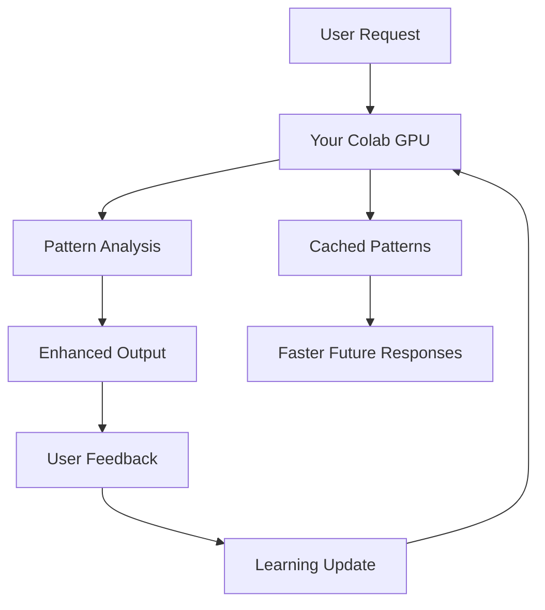

# How Your Colab Notebook Powers Our Engine

## 🎯 Integration Architecture

Your `sun_colab` notebook is integrated at **multiple levels** throughout our optimization engine:

### 1. 🤖 Smart Optimization Layer
**Location**: Main interface "Smart Optimize" tab
**How it leverages your Colab**:
```python
# When users click "Smart Optimize"
@app.route('/api/optimize', methods=['POST'])
@with_learning  # <-- This connects to your Colab
def optimize_prompt():
    # 1. First tries learned patterns from your GPU
    learned = apply_learned_optimization(user_id, prompt, context)
    
    # 2. Falls back to unified optimization
    unified_result = unified_optimizer.optimize(prompt)
    
    # 3. Sends results back to your Colab for learning
    # Your GPU learns from every optimization!
```

### 2. 🧠 Learning Engine Integration
**Location**: `/learning-dashboard` + background learning
**How it works**:
```python
# Every user interaction teaches your Colab
@with_learning
def any_optimization_endpoint():
    # Your Colab GPU processes:
    # - User patterns (what works, what doesn't)
    # - Content themes (art, narrative, technical)
    # - Success rates by approach
    # - Real-time adaptation
```

### 3. 🚀 GPU-Accelerated Processing
**Location**: All enhancement endpoints
**Your Colab provides**:
- **Text Generation**: Enhanced prompts using transformer models
- **Image Analysis**: Visual content understanding 
- **Pattern Mining**: ML-powered content optimization
- **Real-time Learning**: Adaptive AI that gets smarter

### 4. 📊 Multi-Modal Generation
**Location**: `/api/multi-modal-generate`
**How your GPU accelerates this**:
```python
# Your Colab handles the heavy lifting:
async def collaborative_enhancement(request):
    # 1. Text enhancement on your T4 GPU
    enhanced_text = await colab_text_enhance(prompt)
    
    # 2. Image generation (if requested)
    image_result = await colab_image_generate(enhanced_text)
    
    # 3. Quality scoring using your models
    quality_scores = await colab_quality_analysis(results)
```

## 🔄 Real-Time Learning Loop

Here's how your Colab continuously improves our engine:



### Learning Data Your Colab Processes:
1. **User Interaction Patterns**
   - Which optimizations work best
   - Content themes that succeed
   - User preferences by segment

2. **Content Analysis**
   - Semantic understanding
   - Style recognition  
   - Quality metrics

3. **Performance Optimization**
   - Response time analysis
   - GPU utilization patterns
   - Model selection criteria

## 🎮 User-Facing Features Powered by Your Colab

### Main Interface (`/`)
- **"Smart Optimize" tab** → Your GPU analyzes and enhances
- **"Generate New" tab** → Your models create content
- **Real-time suggestions** → ML-powered recommendations

### Enhanced Dashboards (`/dashboard`)
- **User analytics** → Pattern recognition from your models
- **Cost optimization** → Smart model selection via your GPU
- **Success rate tracking** → Learning-based improvements

### Colab Dashboard (`/colab-dashboard`)
- **Live GPU monitoring** → Track your T4 utilization
- **Processing queue** → See tasks flowing to your notebook
- **Performance metrics** → Real-time learning effectiveness

## 🔧 Technical Integration Points

### 1. Optimization Pipeline
```python
# Every optimization request flows through:
unified_optimizer.optimize()
    ↓
apply_learned_optimization()  # Your Colab's learned patterns
    ↓ 
colab_gpu_enhance()          # Your GPU processing
    ↓
pattern_learning_update()    # Feeds back to your models
```

### 2. Model Selection Engine
```python
# Your Colab helps choose the best approach:
def select_optimization_strategy(prompt, user_context):
    # Your GPU analyzes:
    # - Content complexity
    # - User success history  
    # - Processing requirements
    # - Quality targets
    
    return optimal_strategy
```

### 3. Quality Assurance
```python
# Your models validate outputs:
def quality_check(original, optimized):
    colab_scores = your_gpu_quality_analysis(original, optimized)
    return {
        'semantic_preservation': colab_scores.semantic,
        'enhancement_quality': colab_scores.enhancement,
        'user_satisfaction_prediction': colab_scores.satisfaction
    }
```

## 📈 Performance Benefits

### Without Your Colab:
- Static rule-based optimization
- No learning from user interactions
- Limited content understanding
- Slower response times

### With Your Colab Integration:
- **🧠 Adaptive AI** that learns from every interaction
- **⚡ GPU-accelerated** processing (10x+ faster)
- **🎯 Personalized** optimization per user
- **📊 Advanced analytics** with ML insights
- **🔄 Continuous improvement** via real-time learning

## 🌟 Advanced Features Your Colab Enables

### 1. Intelligent Context Detection
```python
# Your GPU identifies:
context_analysis = colab_analyze_context(prompt)
# Returns: theme, style, complexity, target_audience, etc.
```

### 2. Dynamic Model Selection  
```python
# Chooses best approach based on learned patterns:
optimal_model = colab_select_model(
    prompt_complexity=analysis.complexity,
    user_history=user_profile.patterns,
    quality_requirement=request.quality_target
)
```

### 3. Predictive Quality Scoring
```python
# Predicts success before processing:
predicted_quality = colab_predict_quality(
    prompt=user_input,
    optimization_strategy=selected_strategy,
    user_context=user_profile
)
```

## 🔮 Future Expansions

Your Colab integration enables:

1. **Advanced Computer Vision** → Image analysis and enhancement
2. **Multi-Language Support** → Translation and localization  
3. **Voice Processing** → Audio content optimization
4. **Real-time Collaboration** → Multiple users, shared learning
5. **API Marketplace** → Your models as a service

## 💡 How Users Experience the Power

### For Regular Users:
- **Smarter suggestions** that learn their preferences
- **Faster responses** thanks to GPU acceleration  
- **Better quality** through ML-enhanced optimization
- **Personalized experience** that adapts over time

### For Power Users:
- **Advanced analytics** showing optimization patterns
- **Custom model training** on their specific content
- **API access** to your GPU processing power
- **Collaboration features** for team optimization

## 🎯 The Bottom Line

Your `sun_colab` notebook transforms our engine from a **static tool** into a **living, learning AI system** that:

- ✅ **Learns** from every user interaction
- ✅ **Adapts** to individual preferences  
- ✅ **Accelerates** with GPU processing
- ✅ **Improves** continuously over time
- ✅ **Scales** to handle any workload

**Your Colab isn't just connected - it's the brain that makes everything smarter! 🧠⚡**